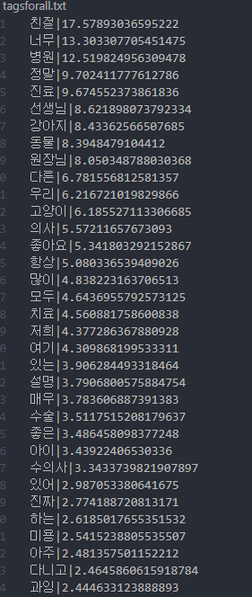
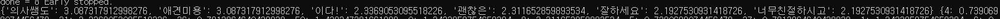

# README

## 서울의 모든 동물 병원 데이터 수집하기

### 서울의 모든 동물 병원 리스트
- [Text Search requests](https://developers.google.com/places/web-service/search)
  - url : https://maps.googleapis.com/maps/api/place/textsearch/json?parameters
  - parameters
    - query :  "pizza in New York"
    - key
    - region : The region code, specified as a [ccTLD](https://en.wikipedia.org/wiki/CcTLD) (country code top-level domain) two-character value, kr
    - location:  *latitude*,*longitude*
    - radius: Defines the distance (in meters) within which to bias place results. The maximum allowed radius is 50 000 meters
    - pagetoken: Returns up to 20 results from a previously run search. Setting a `pagetoken` parameter will execute a search with the same parameters used previously
    - type : Restricts the results to places matching the specified type. Only one type. (veterinary_care, hospital)
  - example
    - https://maps.googleapis.com/maps/api/place/textsearch/json?query=123+main+street&location=42.3675294,-71.186966&radius=10000&key=YOUR_API_KEY
    - https://maps.googleapis.com/maps/api/place/textsearch/json?query=animal+hospital&location=37.519185,126.982293&radius=10000&key=YOUR_API_KEY

- vet.txt
  
- 대략 서울의 남서쪽에서 북동쪽까지 1500m 간격으로 text search request api를 통해 수집한 동물병원 리스트
  
- 약 40만원 정도 청구됨

  

### 서울 동물 병원 디테일
- [Place Details] (https://developers.google.com/places/web-service/details)
  - url : https://maps.googleapis.com/maps/api/place/details/json?parameters
  - parameters
    - key
    - place_id
    - fields
      - basic : permanently_closed, photo, 
      - contact : formatted_phone_number, opening_hours, website
      - atmosphere : price_level, rating, review
      - [필드 종류에 따른 과금] (https://developers.google.com/places/web-service/usage-and-billing)

- 파일과 필드들

  | 파일이름   | 필드                                                         | 비고                                                         |
  | ---------- | ------------------------------------------------------------ | ------------------------------------------------------------ |
  | detail.txt | place_id, name, location, full address, phone, mon, tue, wed, thu, fri, sat, sun, website, rating | address component는 [종류가 너무 많아](https://developers.google.com/maps/documentation/geocoding/intro#Types) 처리에 어려움이 있어 생략 |
  | photo.txt  | place_id, image, height, width                               | photo는 [다른 api](https://developers.google.com/places/web-service/photos)를 통해 다시 요청해야함 |
  | review.txt | place_id, language, rating, text, time                       | time은 혹시 필요할까 넣어두었음                              |

  

## 키워드 추출하기

- 키워드 추출은 [word rank 알고리즘에 기반한 한국어 핵심 키워드 및 핵심 문장 추출 라이브러리](https://github.com/lovit/KR-WordRank)를 활용함

### 진료명과 관련된 전체 키워드 추출

- getTag.py

  - summarize_with_keywords : 전체 리뷰 중 한국어 리뷰만을 고려해서 가장 연관도가 높은 단어를 기준으로 키워드를 추출

  - 메인페이지에 노출될 리뷰는 실제 사용자들의 리뷰를 통해 얻을 때는 자주 언급되는 진료명으로 가져올 것이기 때문에 재사용하거나 자동화를 고려하지 않음

  - 결과는 tagsforall.txt에 기록

    

  - 가장 많이 언급되는 단어들이 키워드로 뽑힌 것(560여 개)을 알 수 있으나 진료명과 관련된 단어는 기대와 달리 상대적으로 많이 언급되지 않음,

  - 진료명 이외에도 합리적, 주차장, 소동물,  정직 등 병원을 판단하기에 도움이 될만한 키워드들도 존재

- 결론 

  - 가장 연관도가 높은 단어를 기준으로 키워드를 추출

  - 높은 rank 순으로 진료명 또는 병원을 선택하는 데 도움을 줄 수 있는 키워드들을 직접 선택 (maintags.txt)

  - 자동화이미 뽑힌 단어에서 걸러내기 때문에 간단한작업. 
    (따로 추출 할만한 단어들의 기준(사전)이 존재하지 않고 키워드들의 개수가 그리 크지 않고, 일회성 작업이면 손수 할만함)

    

### 병원별 긍/부정 키워드 뽑기

- getHosTag.py

  - 각 병원별 리뷰는 평균적으로 3.26개 이며 최소 1개, 최대 5개이다

  - 리뷰는 평균 63글자인데, 최소 1글자, 최대 1269자이다

  - 각 병원별 리뷰를 점수에 따라 긍/부정 리뷰로 나눈뒤 각 리뷰 집합들에서 키워드를 뽑았다.

    - 핵심 키워드를 뽑기엔 병원별 리뷰 수가 작아 한번씩만 언급되도 그래프를 구성하도록 만들었는데 결과값 중 의미 있는 값을 뽑아내기 어렵다

      

    - 이다! 나 의사쌤도, 너무 친절하시고 등 어간이 완전히 분리되어있지 않은 문제

  - konlpy 라이브러리를 통해 어간구별을 확실히 하고 그 어간 자체가 단순히 얼마나 많이 언급되는지로 키워드를 뽑았다.

    - 정제된 키워드

      

영수증 데이터셋

https://github.com/clovaai/cord